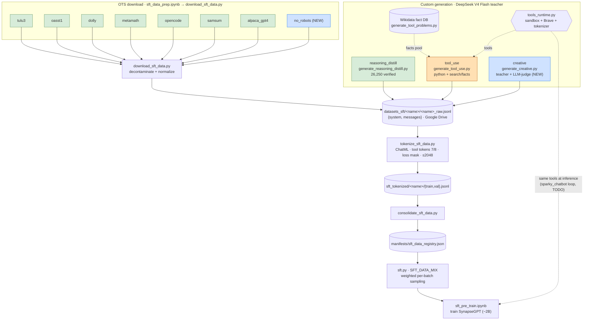

# SynapseGPT — SFT data flow

All SFT inputs, the notebook/script that produces each, where the data lives on
Drive, and how it flows to training. The Mermaid diagram below renders inline on
GitHub/VS Code; a rendered image is also committed
(`SFT_DATA_FLOW.png` / `.svg`, regenerate with
`dot -Tpng sft/SFT_DATA_FLOW.dot -o sft/SFT_DATA_FLOW.png`).

**Status legend:** 🟩 on Drive · 🟦 new/ready · 🟧 in progress

## Source table

| Source | Type | Notebook → script | Raw file (`datasets_sft/<name>/`) | Status |
|---|---|---|---|---|
| tulu3, oasst1, dolly, metamath, opencode, samsum, alpaca_gpt4 | OTS | `sft_data_prep.ipynb` → `download_sft_data.py` | `<name>_raw.jsonl` | 🟩 on Drive |
| **no_robots** | OTS | ″ | `no_robots_raw.jsonl` | 🟦 not downloaded yet |
| reasoning_distill | custom | `generate_reasoning_distill_colab.ipynb` | `reasoning_distill_raw.jsonl` | 🟩 26,250 |
| tool_use | custom | `generate_tool_use_colab.ipynb` | `tool_use_raw.jsonl` | 🟧 regenerating (clean) |
| **creative** | custom | `generate_creative_colab.ipynb` | `creative_raw.jsonl` | 🟦 tested, not run |

**Helpers (not sources):** `generate_tool_problems.py` builds the Wikidata fact DB feeding `tool_use --mode search`; `tools_runtime.py` is the shared sandbox/Brave/tokenizer runtime used by `generate_tool_use` and (TODO) the inference tool-loop in `sparky_chatbot.py`.

## Open item
`SFT_DATA_MIX` in `sft.py` lists only the 7 original OTS sources. `reasoning_distill`,
`tool_use`, `creative`, `no_robots` must be **added after each is tokenized** (the
trainer hard-fails on a mix source with no `train.jsonl`).
